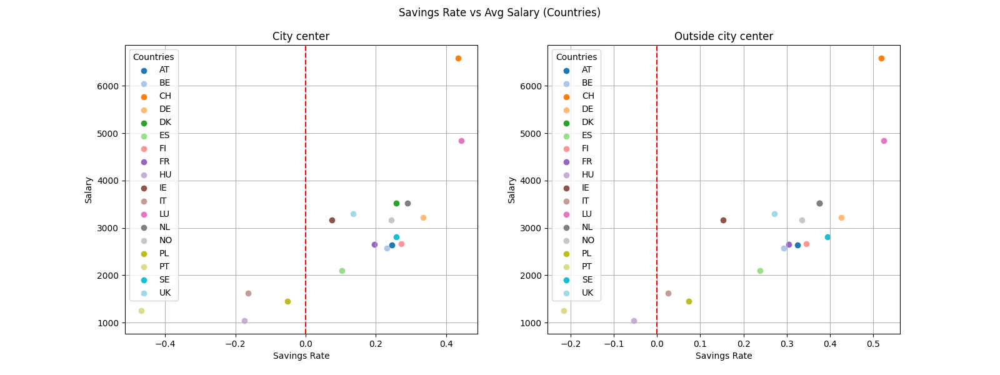
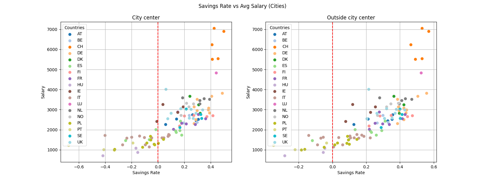
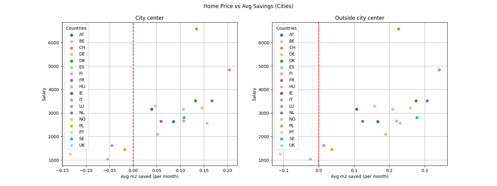
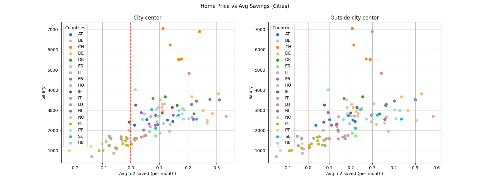

# Cost of Living

This repo provides a relative analysis of costs of living in several EU and non-EU cities.  
All data has been sourced from Numbeo.com around May 2024.

## Installation requirements
Make sure to have python 3 installed. Then run:
```sh
git clone https://github.com/Danver97/cost_of_living.git
cd cost_of_living
pip install -r requirements.txt
```

## Usage

This projects has been designed to be open for modification.

Currently there are two scripts:
- `collect.py` used for gathering data. It writes (overwrites if already present) `cities.csv`.
- `analysis.py` used for plotting and analysis. It reads `cities.csv` in the same repo directory.

A small dataset of ~100 cities is already provided under `cities.csv`. Feel free to add more countries and cities to collect in `collect.py`.

## Analysis

The goal of the analysis was to evaluate each country and city overall affordabily for an average person living there and earning an average local *net* salary.

**Note**: this is a relative analysis. Data may not be *100%* accurate, but should be good enough to get an overall comparison between different cities and countries.

Currently data from the following countries have been collected. The top N cities by population for every country have been considered, where N varies depending on the country overall population size and data availability from Numbeo.com. In general, cities with less than 200 entries have not been considered.

Countries considered for collection ([two-letter country codes](https://en.wikipedia.org/wiki/List_of_ISO_3166_country_codes)): AT, AU, BE, CA, CH, CZ, DE, DK, ES, FI, FR, HU, IE, IS, IT, LU, NL, NO, PL, PT, RO, SE, SK, UK, US.

For the analysis of the affordability the following metrics have been considered:
- Average saving rate when renting alone (living in the city centre and outside the city centre)
- House price compared to the average monthly salary and the average month savings (city centre and outside the city centre)

For the house price specifically, when compared to the average monthly savings a solo-rent has been considered into the living expenses. In this way, I personally feel it better captures how hard it is to save without external help for a house downpayment.

For the reducing the graph readability (already not great) the following countries have been dropped: AU, CA, CZ, IS, RO, SK, US.

### Terminology
- Salary: the average **net salary** (after-tax)
- Expenses: the total average monthly living expenses (rent, food, utilities and leisure) of a person living alone (no flatmates, not staying with their parents).
- Savings: the difference between the average monthly salary and the average monthly expenses.
- Savings rate: the ratio between monthly savings and monthly salary.
- Squared meters earned: when buying a new home, how many squared meters your monthly salary corresponds.
- Squared meters saved: when buying a new home, how many squared meters your monthly savings correspond.

Unfortunately, home prices are listed per square meter on Numbeo.com. Given what the average home size is a personal preference, I had to create the concept of "squared meters earned" and "saved".

### Results

Ideally, everybody wants to earn a lot and be able to save a lot.
From that idea, I decided to always keep the average salary on the y axis and the savings metric on the x axis. Given that, everyone would like to be in the top right corner.

At the same time, this helps visualize how in some cities earning a lot in absolute terms, might not mean being able to save more (in relative terms).

Given that, the following is the brief analysis.



As it can be seen, south (except for Spain, ES) and est europe countries are the least affordable for locals as in some situations it's also hard to be able to save.
Negative numbers, could be possibly explained in three (not-exclusive) ways:
- People tend not to live alone as it wouldn't be affordable
- People tend to live in nearby smaller towns and commute
- Average expenses metrics computed by numbeo might consider some leisure expenses that due to low salaries are usually avoided by locals.

Nevertheless, I personally think this still denotes a lower affordability.

The best country seems to be CH and LU.



When segmented by city, the previous considerations remain valid for HU, IT, PT, PL that show a well clustered pattern in the low-affordabilty part.

All other countries are offer on average an higher affordability, with spain more concentrated in the lower spectrum and Germany in the highest. The thing to note, though is that this varies a lot depending on the city.

The best country for each of the cities it's confirmed to be CH and LU.




At aggregate level, the top 5 countries for homeownership appear to be LU, NL, SE, DK, DE.
Previously low-affordable countries are confirmed to be the least affordable also in this scenario.

When comparing at city-level though, the affordability change quite drastically.

For other countries, the result is not really clear and varies hugely by city. CH and LU cities overall do not appear anymore as the most affordable overall with major cities like Frankfurt, Rotterdam and Malmo taking the lead over CH and LU ones.

### Conclusions

I hope this could provide better insights all together of which of the european cities are the most affordable, possibly helping deciding where to live in Europe.

## Contributing

Feel free to open issues, PRs and suggest any further improvement.
